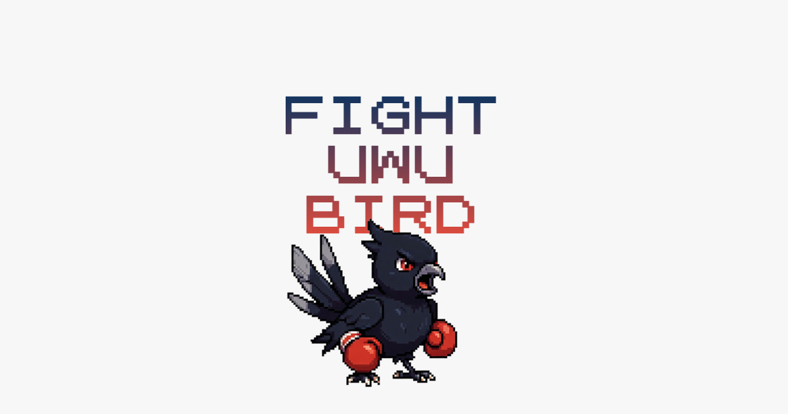
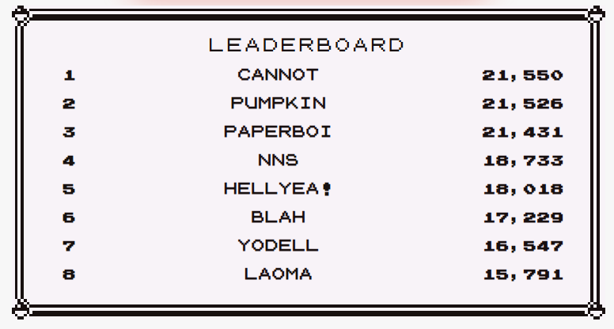
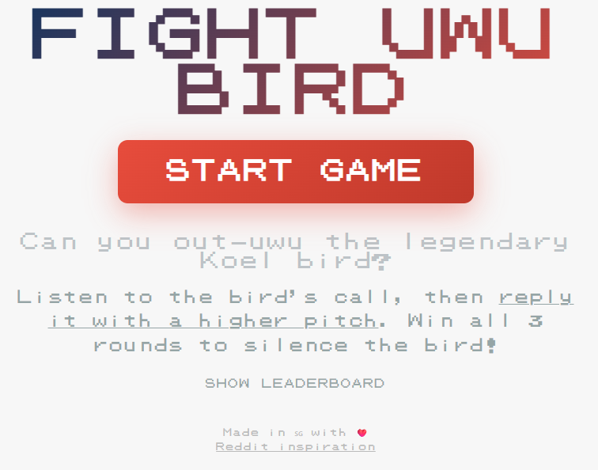
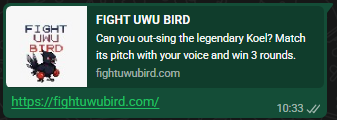
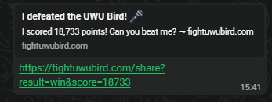
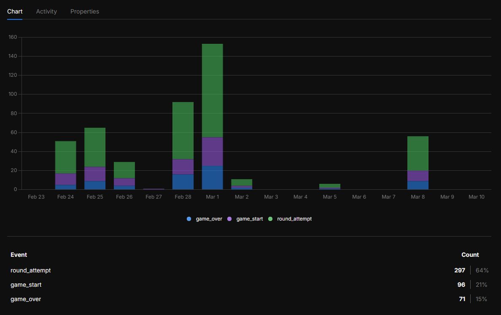

[Play the game [here](https://fightuwubird.com)]

# Introduction

I made a simple game with a distinctly Singaporean flavour. Yes, I grew up in Singapore, waking up to the distinctive calls of the Koel bird (a.k.a. Uwu bird) which inspired this game. No, I don't have any experience in full-stack development or the skills to build a web app. Yes, I have been using generative AI (specifically Claude Code) for more than a year now, increasing the my pace of development - _on tasks that I personally know how to do_. So what's new?

For me personally, this is the first time I've successfully "vibe-coded" something I have no expertise in. Previously, I've had a clear view of the entire scope of the task — e.g. build a signal processing pipeline — and prompted Claude in building each block within the pipeline (e.g. do fourier transform, then apply a filter here, etc.).

Vibe coding (or now its evolved form: [agentic engineering](https://x.com/karpathy/status/2019137879310836075)) is different in that you describe outcomes, not steps to take. And the LLM models have gotten good enough that the outcomes can be achieved with a lot less handholding.

In the remainder of this blog, I'll describe my journey in co-creating the game with Claude.

# The Idea

Two main sources of inspiration for this game. First: on an overseas trip with some Singaporean friends, we started "uwu-ing" to geolocate and find each other in a crowd. It was such a unique sound that for some reason perks up Singaporean ears, but isn't too much of nuisance for the Europeans we were surrounded by. Second: [this reddit post](https://www.reddit.com/r/askSingapore/comments/1p72dng/how_do_you_deal_with_the_uwu_bird_right_outside/) (hilarious).

Hence, the initial idea: what if you could make an app that "fights" the real-world Uwu bird disturbing your sleep at 5AM, getting it to shut up?

Then, the (debatably) better idea: what if there was no real-world Uwu bird at all, and I just made it into a game?

## Cooking with Claude

So I described to Claude the basic idea of the game: to make progressively higher pitched "uwu" calls. Claude then thought for a bit, and gave a basic outline to build out this game. At this point it was just the signal processing pipeline — to take in human "uwus" as audio input, and compare it against the game's reference.

I also knew it had to hosted on the web, because who downloads apps nowadays? Claude then suggested a frontend / backend server configuration. As Claude explained to me, the responsibility of the backend server was to do the signal processing, while the frontend server would display cues and results to the player.

*Tip: When vibe coding with any frontier model, first have a conversation with it on your desired outcomes. Then, tell it to write you a tech spec document before starting to code. This tech spec will be the grounds to evaluate the efficacy of the code. Just feed it back to the model and ask it to evaluate what it has written.*

# First Try

With that very vague brief and 10mins of conversation, I let Claude cook while I made coffee. In 10mins it was done. Here's the crazy thing - the entire game worked! No issues on the first playthrough, except that I lost because I couldn't "uwu" at a high enough pitch. Even so, the "You Lost" display animation was already baked in, and I marvelled in my defeat. Claude even (pre-emptively) told me what configuration parameters to change to make the game easier.

## But…

While the game played well, the website design was very generic. Granted, I did not specify anything, and Claude already took the initiative to include a "dark aesthetic to mirror the Koel bird's pre-dawn calls". Still, I wanted something more fun.

Again, very hazy thought went into this. The flow went like this: "I need a better design for this fighting game" → "fighting, like battling this noisy bird monster" → "OH LIKE POKEMON BATTLE?"

So I told Claude I wanted to make it a pokemon battle aesthetic. It looked for CSS stylings that reflected the vibe, and asked me to provide images for the battle. I went onto Grok and generated the UWU Bird and Annoyed Auntie images, and then set Claude loose.

*Tip: As before, I asked for a tech spec for the frontend re-design as the basis of evaluation. I also prompted it to use Playwright library to test its code implementation, as that allowed it to "see" what's displayed on the website*

*Another tip: I asked Grok for an image of the bird first, then used that image as input to generate a "win" or "lose" video. Claude then coded it such that the bird *hadoukens* or *cries* depending on whether you win or lose.*

# Second Try

Another 10mins later, Claude was done. That's basically everything you see about the game experience - including the health bar animations, the way the bird "vibrates" when it makes the "uwu" call, etc. And all it took was two 10min conversations, wow.

# Sprinkles and Seasoning

With the core game done and still a couple hours left before lunch, my brain started whirring. How can I make this project better? As the adage goes, "the only reward for good work is more work" — so I made Claude work more.

## Leaderboard

In keeping with the retro gaming aesthetic, I thought user engagement might increase if I added a leaderboard. So I ask Claude, and it told me what it needed (i.e. a database to keep track of scores), proposed a visual layout, and a way of scoring each attempt through adaptation of the signal processing pipeline.

I also remembered how naughty I was in arcade games as a kid, so I asked Claude to do a profanity check for leaderboard entries - it found a Python library, connected to the leaderboard database, added scoring, and the leaderboard function was ready in another 2mins. It even "sanitised" the entries on its own, so hackers can't inject malicious commands into that PlayerName textbox entry. I didn't even think of that until it told me.

## Landing Page

To be honest, I didn't even write the copy at the landing page myself - Claude did that. However, I wanted to credit the inspiration for the game, so I gave it the link to the reddit thread and it inserted it in.

## Link Sharing

When I started testing it out with friends, I realised my link just looked this: [https://fightuwubird.com](https://fightuwubird.com). But sharing social posts on Whatsapp came with rich visual information (you can even play Instagram videos in the chat), which I wanted to mimic. I told Claude, and it told me about something called Open Graph protocol, and asked me for a display image. A quick paintjob later, and Claude implemented the Open Graph protocol so my links now look like this:

When you share your scores, the link and description changes. But clicking on that link still brings you back to the landing page.

# Deployment

Up till now, I was testing the app on my own machine. To serve it to the hundreds of Annoyed Aunties out there, I needed an easy way to host it. Claude suggested using Railway, and guided me through on the setup. This also included connecting up the leaderboard database, and basic analytics with Umami.

Apart from generating images, this was the most manual process, but it was made easy with Claude.

## Debugging
(Finally having to debug, and only near the very end of development)

I knew from personal experience that the website will likely be visited on mobile, because who's going to open their laptop just to scream birdcalls into it? While Claude optimised for mobile, there were teething issues with iOS because I didn't have an iPhone to test with. I described the problems my friends were having, and Claude fixed them, pushed the code, and Railway auto-deployed it. It took an hour for Claude to isolate the problem, but honestly it was relatively painless considering I didn't have a clue what was wrong.

## Reception

It's been two weeks since the site went live, and we've gotten almost 300 rounds played so far. Friends have been generally supportive, and I'm happy with results after a weekend of work.

# Reflections

## Mental Framework

During this vibe-coding adventure, I realised that success in this approach comes down to logical thinking, and an engineering mentality. There's no need to in-depth technical knowledge in the coding languages or libraries being used. Instead, success depends on the ability to describe the desired outcome, to break down the outcomes into chunks for independent testing. It was almost an exercise in engineering management, rather software development.

## Moving Up the Value Chain

If you've been on the internet at all recently, you'd have certainly come across news on generative AI "taking over our jobs". Technological progress has always threatened job security, but that doesn't mean workers can't upskill and move up the value chain in their industry or others. An example from history: with the introduction of the Personal Computer, the need for a typing pool in offices were phased out. These typists lost their core job (the physical act of typing), since a computer was now sitting on every desk. However, many moved up the value chain, becoming executive assistants or data entry specialists.

We're in a similar age today - technology enablers like generative AI are democratising the skill of software engineering the same way Personal Computers democratised typing and document generation. I decided to try moving up the value chain myself, and you can too.

Perhaps the fears are compounded today because of the terrifying pace of AI improvements. I don't deny that exponential trend, but I can also say from this weekend that the improvement in capability makes it easier to use, not harder. Increasingly these days, you just need to talk to the model.
